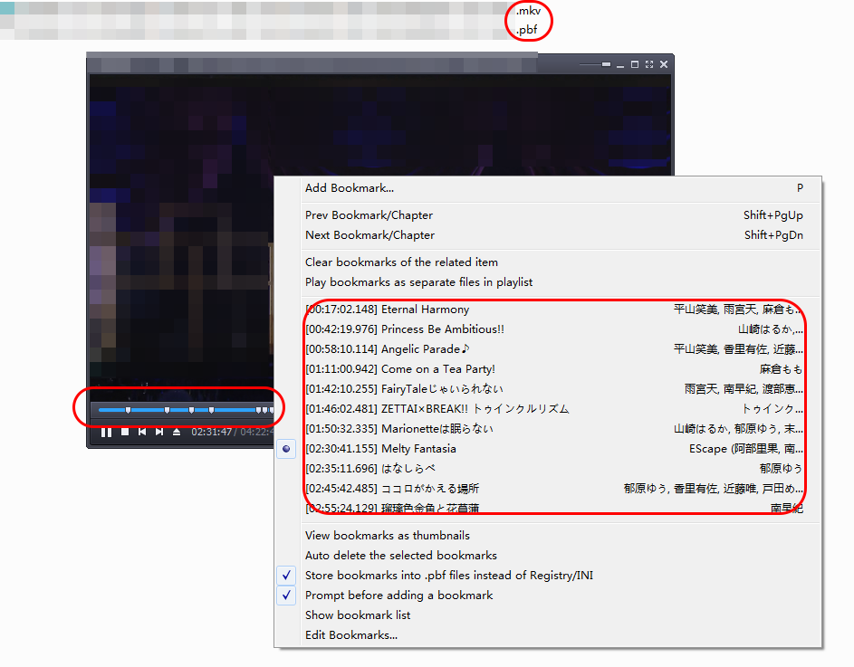

# chapter_converter
Convert between several different video chapter file formats with ease.

## Features

* Auto input format detection: including chapter files and video files with chapters (`.mkv` and `.mp4`. Requires `mkvtoolnix` binaries in path).
* Auto input encoding detection
* Can specify output format and filename
* Clipboard support (input and output) for editing purposes
* This fork adds support for YouTube timestamps

## Usage

```
usage: chapter_converter.py [-h] [-f {simple,pot,ogm,tab,xml}] [--mp4-charset MP4_CHARSET] [--charset CHARSET] [-o OUTPUT] [-c] [filename]

positional arguments:
  filename              input filename

optional arguments:
  -h, --help            show this help message and exit
  -f {simple,pot,ogm,tab,xml}, --format {simple,pot,ogm,tab,xml}
                        output format (default: pot)
  --mp4-charset MP4_CHARSET
                        input chapter charset for mp4 file, since it can't be auto detected (default: utf-8)
  --charset CHARSET     output file charset (default: utf-8-sig)
  -o OUTPUT, --output OUTPUT
                        output filename (default: original_filename.format[.txt])
  -c, --clipboard       automatically process text in clipboard and save it back.
```

Note: A simple GUI is provided by running `gui.py`. You need to install module `gooey` in `pip` separately to make it work. See https://github.com/fireattack/chapter_converter/pull/4#issuecomment-1359129224 for some caveats.

As a Python module:

```python
from chapter_converter import main

main('input.pbf', '-o', 'output.xml')
```

### Note

* Output by default saved as UTF-8-BOM for max compatibility on Windows. You can change it by passing in `--charset` argument.
* When `-c` is used, you can still pass in a file as input instead.
* When `-c` is used, you can still pass in an output filename (using `-o` and/or `-f`) as output instead.

## Supported formats

See also: example files in `examples`.

### MKV and MP4 video containers (inputs only)

Guessed by suffix. Not idiot-proof, please only feed in file with chapters.

### YouTube format (`youtube`)

YouTube supports timestamps without hours or milliseconds.

Format:
* Each line: `{timestamp} {title}`

Example:

```
17:02 Title1
42:19 Title2
58:10 Title3
9:16:07 Title4
...
```

### Simple format (`simple`)

I made it up.

Format:
* Each line: `{timestamp},{title}`

Example:

```
0:17:02.148,Title1
0:42:19.976,Title2
0:58:10.114,Title3
...
```

### Tab format (`tab`)

Similar to Simple, but separated by tab instead of comma.

Format:
* Each line: `{timestamp}    {title}`

Example:

```
0:17:02.148    Title1
0:42:19.976    Title2
0:58:10.114    Title3
...
```

### OGM format (`ogm`)

Can be recognized by common video tools, such as [MKVToolNix](https://mkvtoolnix.download/).

Format:
* Odd lines: `CHAPTER{i:02}={timestamp}`
* Even lines: `CHAPTER{i:02}NAME={tilte}`

`i` starts at 1.

Example:

```
CHAPTER01=0:17:02.148
CHAPTER01NAME=Title1
CHAPTER02=0:42:19.976
CHAPTER02NAME=Title2
CHAPTER03=0:58:10.114
...
```

### MediaInfo format (`mediainfo`)

The way [MediaInfo](https://mediaarea.net/en/MediaInfo) presents chapter information in text form. Input only. Supports both with or without the "Menu" line.

Format:
* Each line: `{timestamp}\s+: ({two_letter_lang_code})?:{title}`

Example:

```
Menu
00:00:00.000                : en:Contours
00:02:49.624                : en:From the Sea
00:08:41.374                : en:Bread and Wine
00:12:18.041                : en:Faceless
...
```

### XML format (`xml`)

XML chapter format defined by [Matroska specification](https://matroska.org/technical/specs/chapters/index.html).

###  [PotPlayer](https://potplayer.daum.net/) Bookmark format (.pbf) (`pot`)

A format PotPlayer uses for its bookmarks. If you put the file together with the video file (same name except extension, just like any external resources), it will be recognized by PotPlayer just like internal chapters - you can use "H" to view and select, and they will show up as markers on navigation bar too:



It is not ideal, but it's the closest thing to "external chapter file" to my knowledge.

Format:

* First line: `[Bookmark]`
* Other lines: `{i}={timestamp_in_ms}*{title}*{some_optional_hash_for_pot_internal_usage}`

`i` starts at 0.

Example:

```
[Bookmark]
0=1022148*Title1*
1=2539976*Titile2*
...
```
